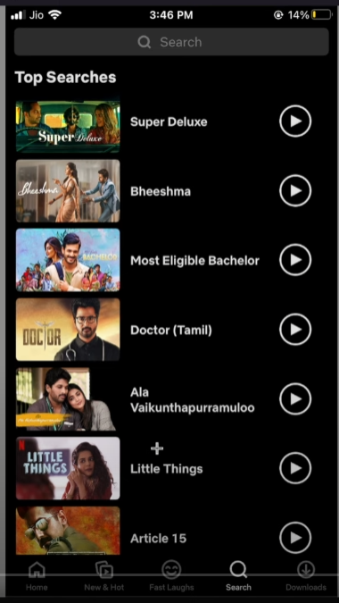
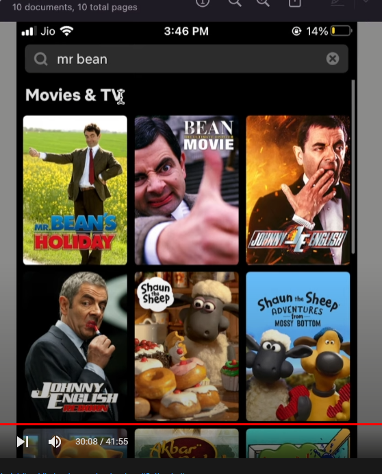

# brot_netflix_app

A netflix ui project

design :

downloads page

search page - search idle

search page - search results

Backend
-------

tmdb : credentials 
username : brototype
password : 1234
API KEY : 86d69a245a7d86220c2aeab2255e4095

Build runner command :
flutter packages pub run build_runner watch --use-polling-watcher --delete-conflicting-outputs